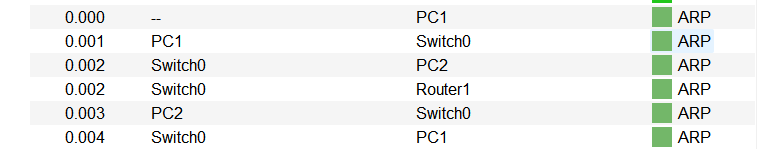
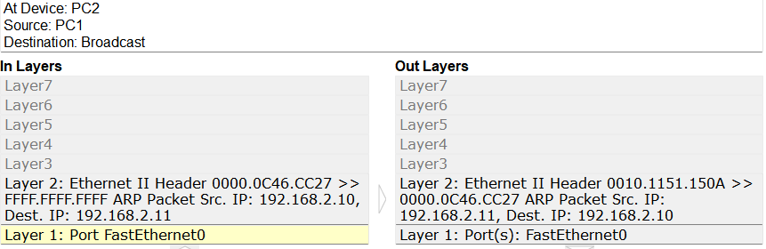
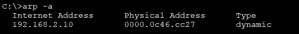
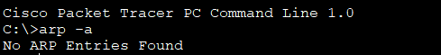
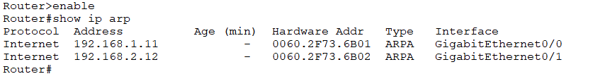
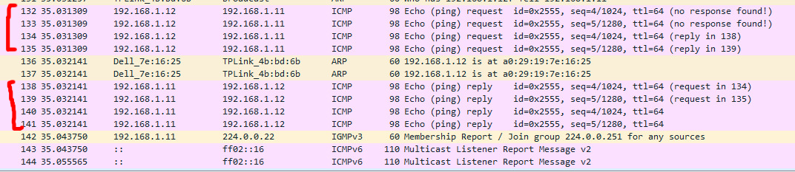

 

# Trabajo Práctico N°1 Redes de Computadoras,FCEFyN-UNC #
## Fecha de entrega: 27/03/2025 ##

ctrl+shift+v to visualize preview 

## Profesores: ##
  -Santiago Martin Henn
  -Francisco Nicolas Oliva Cuneo

## Nombre del Grupo: ##
 “Redes,Sudor y Lágrimas” 

## Integrantes: ##
- Badariotti, Juan Miguel - 42260003
- Cáceres, Juan Manuel - 41411969
- Erlicher, Ezequiel - 42051917
- Dallari, Giuliano - 42642389

 

# Parte I - Configuración y Análisis de tráfico IPv4/IPv6 #

## 1) Marco teórico para los ejercicios a realizar ##

### Principios de la interconexión entre redes ###

La siguiente tabla muestra algunos de los términos más comúnmente utilizados y relacionados con
la interconexión entre redes (internetworking). Un conjunto de redes interconectadas, desde el punto de vista del usuario, puede aparecer simplemente como una red más grande. Sin embargo,si cada una de las redes constituyentes retiene su identidad y se necesitan mecanismos especiales parala comunicación a través de múltiples redes, entonces a la configuración entera se le conoce como conjunto de redes (o una internet)

**Los requisitos globales para un sistema de interconexión entre redes son los que siguen a continuación:**
1. Proporcionar un enlace entre redes. Como mínimo, se necesita una conexión física y de
control del enlace.
2. Proporcionar el encaminamiento y entrega de los datos entre procesos en diferentes redes.
3. Proporcionar un servicio de contabilidad que realice un seguimiento de la utilización de las
diferentes redes y dispositivos de encaminamiento y mantenga información de estado.
4. Proporcionar los servicios mencionados de forma que no se requiera la modificación de la
arquitectura de red de cualquiera de las redes interconectadas. Esto significa que el sistema
de interconexión entre redes se debe acomodar a las diversas diferencias existentes entre
las distintas redes. Una de estas diferencias es, por ejemplo, el tamaño máximo de paquete.Puede que se necesite romper un paquete en unidades más pequeñas al pasar a otra red. Este proceso se denomina fragmentación.

### Interconexión entre redes sin conexión ###

Interconexión entre redes sin conexión

La interconexión entre redes sin conexión se refiere a la manera en que diferentes redes pueden comunicarse entre sí, incluso cuando no están directamente conectadas de manera continua. En lugar de mantener una conexión activa todo el tiempo, las redes pueden intercambiar información a través de redes intermedias que almacenan y transmiten los datos cuando sea necesario. Un ejemplo de esto es el routing asincrónico, en el que los datos se almacenan temporalmente y luego se envían a su destino cuando se restablece la conexión. Este tipo de interconexión es común en entornos con limitaciones de infraestructura o en redes de comunicación por satélite y por radiofrecuencia.

### El protocolo IPv4 ###

El Protocolo de Internet versión 4 (IPv4) es el estándar de comunicación en redes basado en direcciones de 32 bits, lo que da lugar a una notación decimal separada por puntos (por ejemplo, 192.168.1.1). Este esquema se utiliza para identificar de manera única a cada dispositivo dentro de una red, permitiendo el enrutamiento de paquetes a través de la Internet.
Algunas de las características de este protocolo son las siguientes:

    --Dirección de 32 bits: Una dirección IPv4 está compuesta por cuatro octetos (8 bits cada uno), lo que da un total de 32 bits. Esto permite un total de 4,294,967,296 direcciones únicas (2^32).

    --Clase de direcciones: IPv4 tiene diferentes clases de direcciones (A, B, C, D, E) que se asignan según el tamaño de la red. Por ejemplo:

        Clase A (1.0.0.0 a 127.255.255.255): Para redes muy grandes.

        Clase B (128.0.0.0 a 191.255.255.255): Para redes medianas.

        Clase C (192.0.0.0 a 223.255.255.255): Para redes más pequeñas.
****
        Clase D (224.0.0.0 a 239.255.255.255): Para direcciones de multicast.

        Clase E (240.0.0.0 a 255.255.255.255): Reservado para investigaciones futuras.

    --Máscara de subred: IPv4 utiliza una máscara de subred para dividir la red en segmentos más pequeños, lo que ayuda a gestionar eficientemente las direcciones IP. La máscara de subred se representa también en formato de 32 bits, y se utiliza para identificar la parte de la dirección que corresponde a la red y la que corresponde a los hosts.

    --Dirección privada y pública: IPv4 tiene un conjunto de direcciones privadas (por ejemplo, 10.0.0.0, 192.168.0.0), que no son enrutables en la Internet pública, y se utilizan dentro de redes locales. Los dispositivos que utilizan direcciones privadas se conectan a la Internet pública a través de NAT (Network Address Translation), que mapea las direcciones privadas a una dirección pública.

    --Limitación de direcciones: Debido a la estructura de 32 bits, IPv4 tiene un límite de aproximadamente 4.3 mil millones de direcciones, lo cual ha sido insuficiente para satisfacer la creciente demanda de dispositivos conectados a Internet. Este agotamiento llevó a la creación de IPv6.

### IPv6 ###

IPv6 es la evolución de IPv4, diseñado para resolver los problemas de agotamiento de direcciones y mejorar el rendimiento de la red. Mientras que IPv4 utiliza direcciones de 32 bits, IPv6 utiliza direcciones de 128 bits, lo que proporciona un espacio de direcciones casi ilimitado. Entre las carácterísticas de este protocolo se puede mencionar:
  
    --Dirección de 128 bits: Una dirección IPv6 está compuesta por ocho bloques de cuatro dígitos hexadecimales (16 bits cada uno), separados por dos puntos, como en 2001:0db8:85a3:0000:0000:8a2e:0370:7334. Esto da lugar a un espacio de direcciones de 2^128 (aproximadamente 340 undecillones de direcciones), lo que es más que suficiente para satisfacer las necesidades de la red mundial durante siglos.

    --Sin clases de direcciones: A diferencia de IPv4, IPv6 no utiliza un sistema de clases de direcciones. En su lugar, la asignación de direcciones se realiza utilizando prefijos, que indican el tamaño de la red. Por ejemplo, un prefijo /64 significa que los primeros 64 bits de la dirección corresponden a la parte de la red, y el resto puede ser utilizado para la asignación de direcciones a hosts.

    --Notación simplificada: Debido a la longitud de las direcciones IPv6, se pueden simplificar eliminando los ceros a la izquierda de cada bloque y usando "::" para representar grupos consecutivos de ceros. Por ejemplo, la dirección 2001:0db8:0000:0000:0000:0000:0000:0001 se puede escribir como 2001:db8::1.

    --Autoconfiguración: IPv6 introduce la autoconfiguración sin estado (SLAAC), que permite a los dispositivos generar automáticamente su dirección IP sin la necesidad de un servidor DHCP. El dispositivo obtiene su dirección utilizando el prefijo proporcionado por el router y combina esto con su identificador único (generalmente basado en la dirección MAC del dispositivo).

    --Mejora en la seguridad: IPv6 fue diseñado desde el principio con seguridad en mente. Incluye el protocolo IPsec (protocolo de seguridad IP) como obligatorio, lo que facilita la implementación de encriptación y autenticación para las comunicaciones de red, mientras que en IPv4 es opcional.

    --Mejoras en el rendimiento: IPv6 optimiza el encabezado de los paquetes de datos, reduciendo la carga de procesamiento y mejorando la eficiencia del enrutamiento. También elimina algunos mecanismos de IPv4 como el checksum, que son redundantes debido a las mejoras en la fiabilidad de las redes modernas.

    --Fragmentación: En IPv6, la fragmentación de paquetes se realiza solo en el origen, lo que mejora la eficiencia de la red. A diferencia de IPv4, en IPv6 los routers intermedios no fragmentan los paquetes, lo que reduce la carga sobre los dispositivos de enrutamiento.

    --Transición de IPv4 a IPv6: La transición de IPv4 a IPv6 no fue inmediata. Durante un largo periodo, se implementaron mecanismos de compatibilidad dual y túneles para permitir que los dispositivos IPv6 se comuniquen con los dispositivos IPv4, como el túnel 6to4 o el uso de NAT64.

## 2) Creación de una Red ##

Se configura la siguiente topología en Packet Tracer para realizar los apartados 4) ,5), 6) y 7)

## 3) Diferencias entre un simulador y un emulador de redes ##

En redes, tanto los simuladores como los emuladores son herramientas utilizadas para probar y analizar el comportamiento de infraestructuras de comunicación. Sin embargo, existen diferencias clave entre ambos:

- Simulador de redes

Un simulador es un software que imita el comportamiento de una red al modelar el tráfico, los dispositivos y los protocolos sin ejecutar el software real de los equipos de red. Un ejemplo para esta definición sería el software Cisco Packet Tracer, donde se caracteriza ya que se crea un entorno virtual donde los dispositivos de red están representados mediante modelos matemáticos. Asi tambien no ejecuta el sistema operativo real de los dispositivos, sino versiones simplificadas.
Su uso es ideal para aprendizaje y pruebas teóricas de configuraciones de red ya que no requiere hardware específico, dado que simula el funcionamiento de los dispositivos.

- Emulador de redes

Un emulador recrea el entorno de red real permitiendo ejecutar el software de los dispositivos en una máquina virtual. Ejemplos de estos podrían ser los softwares GNS3 o CORE, donde sus características son que usa imágenes reales de sistemas operativos de routers y switches, como Cisco IOS. Tambien permite probar configuraciones en un entorno idéntico al de producción por lo que uede integrarse con redes reales para pruebas avanzadas, pero debido a esto es más demandante en términos de recursos computacionales, ya que ejecuta sistemas operativos completos.

En resúmen, un simulador es útil para aprender sobre redes y probar configuraciones simples, mientras que un emulador permite replicar escenarios reales con mayor fidelidad, facilitando la implementación de soluciones en producción.

## 4)  Conectividad IPv4 entre todos los host ##

Se evalúa la conectividad entre las 3 computadoras de la topología mostrada en  el punto 2
mediante el envío de paquetes ICMPv4 usando el comando `ping`

PC0:

PC1:

PC2:

## 5)  Conectividad IPv6 entre todos los host ##

ahora se evalúa de nuevo la conectividad de las 3 computadoras de la topología 2) pero ahora con respecto a sus direcciones IPv6 enviando paquetes ICMPv6(también con el comando `ping`)

IPv6 PC0:

IPv6 PC1:

IPv6 PC2:

## 6) Trafico ICMPv4 entre clientes ##

a) Las comunicaciones ARP que se observan son las utilizadas por los distintos dispositivos para conocer la dirección Mac de cada uno de los otros dispositivos. Al hacer ping desde H1 a H2, solo conocemos la dirección ip de H2. Se procede entonces a hacer una comunicación Broadcast a todos los host conectados al Switch, y solo responderá el que posee la dirección ip a la cual estamos haciendo ping, en este caso H2. Como se ve en la imagen, el mensaje pasa de H1 al router, del router al switch, y del switch a H2 y H3. Solamente responderá con su dirección Mac H2, que sería el mensaje que va primero de H2 al switch, y luego del switch al router. 

b)

c) Cuando llega un paquete a la interfaz del router, el router examina la dirección IP de destino del paquete y busca en su tabla de enrutamiento para determinar dónde enviar el paquete. La tabla de enrutamiento contiene una lista de todas las direcciones de red conocidas (prefijos) y a dónde enviar el paquete. 
Un router puede descubrir redes remotas de dos maneras:
Manualmente - las redes remotas se ingresan manualmente en la tabla de rutas mediante rutas estáticas.
Dinámicamente - las rutas remotas se aprenden automáticamente mediante un protocolo de enrutamiento dinámico.

d) Lo utilizamos para dirigir el tráfico de datos desde el dispositivo de origen hasta el de destino dentro de la red. Opera en la capa de enlace de datos del modelo OSI razón por la cual para establecer comunicaciones entre sí lo hace utilizando direcciones mac y no necesita de direcciones IP en sus interfaces.

e) Contiene la dirección ip y mac del router. Dispositivo con el que se comunicó para poder enviar el mensaje a h2.

f) La tabla arp de h3 se encuentra vacía ya que aún no ha iniciado comunicación alguna.

g) Contiene las direcciones ip y mac de h1 y h2 junto al tiempo en minutos que cargó su información.

h) Si los datos encapsulados son un paquete broadcast IPv4, esto significa que el paquete contiene una dirección IPv4 de destino que tiene todos los (1s) en la parte del host. Esta numeración en la dirección significa que todos los hosts de esa red local (dominio de broadcast) recibirán y procesarán el paquete.

i) Una trama de multicast de Ethernet es recibida y procesada por un grupo de dispositivos en la LAN de Ethernet que pertenecen al mismo grupo de multicast. Si los datos encapsulados son un paquete de multicast IP, a los dispositivos que pertenecen a un grupo de multicast se les asigna una dirección IP de grupo de multicast. El rango de direcciones de multicast IPv4 es 224.0.0.0 a 239.255.255.255.

## 7) Trafico ICMPv6 entre clientes ##

a)

b) y c) NDP es un protocolo utilizado en redes IPv6, que reemplaza al protocolo ARP (Address Resolution Protocol) que se emplea en redes IPv4. Entre las funciones que lleva a cabo, se incluyen el descubrimiento de vecinos (ND: Neighbour Discovery) para obtener las direcciones MAC de otros dispositivos, la autoconfiguración de direcciones mediante Stateless Address Autoconfiguration (SLAAC), y la detección de duplicados de direcciones (DAD) para evitar conflictos de direcciones. Además, permite el descubrimiento de routers en la red mediante los mensajes de Router Solicitation y Router Advertisement, y la redirección de tráfico hacia routers más eficientes usando mensajes de Redirect. Finalmente, NDP gestiona la monitorización de la conectividad entre dispositivos mediante Neighbor Unreachability Detection (NUD), lo que permite identificar dispositivos inalcanzables y mantener actualizada la tabla de vecinos.

d) En IPv6, el mensaje de broadcast (transmisión a todos los dispositivos de la red) se elimina y se reemplaza por los mensajes de multicast.
 Multicast: En lugar de enviar un mensaje a todos los dispositivos de la red, este mensaje permite enviar datos solo a un grupo específico de dispositivos que se han inscrito para recibir esos mensajes. Los dispositivos que deseen recibir un mensaje multicast deben unirse a un grupo (llamado de multicast justamente). Esto es más eficiente porque solo los dispositivos interesados reciben el tráfico, en lugar de todos los dispositivos de la red. Las direcciones multicast en IPv6 comienzan con el prefijo FF00::/8.

e) Local link address (LLA): Los LLA se utilizan para comunicarse con otros dispositivos en el mismo enlace local. Con IPv6, el término “enlace” hace referencia a una subred. Las LLA se limitan a un único enlace. Su exclusividad se debe confirmar solo para ese enlace, ya que no se pueden enrutar más allá del enlace. En otras palabras, los routers no reenvían paquetes con una dirección de origen o de destino link-local. Utilizan el prefijo FE80::/10. 2 computadoras conectadas a la misma LAN pueden usar estas direcciones para comunicarse.
 Unique-Local (Unique Local Addresses - ULA): Estas direcciones son válidas dentro de una organización o red privada (También pueden ser utilizadas para conexiones entre diferentes redes privadas), pero no deben ser enrutadas globalmente en la Internet. Son similares a las direcciones privadas en IPv4, como las direcciones 192.168.x.x o 10.x.x.x . Se utilizan en redes privadas para permitir la comunicación entre dispositivos dentro de la misma organización o red sin la necesidad de direcciones globales. 
 Global unicast address (GUA) : Estas direcciones son similares a las direcciones IPv4 públicas. Estas son direcciones son globalmente exclusivas y enrutables por medio de Internet. Las GUA pueden configurarse estáticamente o asignarse dinámicamente. El prefijo para este tipo de direcciones es 2000::/3. Para enviar un mensaje entre 2 teléfonos celulares conectados en distintas redes (por ejemplo uno en ciudad universitaria y otro en el patio olmos) se usa este tipo de direcciones.

 

# Parte II - Configuración y Análisis de tráfico IPv4/IPv6 #

## 1) Descripción del switch Cisco Cisco Catalyst series 2950 ##

Imagen del switch utilizado en esta parte del práctico:

 

El Switch utilizado para esta parte del práctico es el Cisco Catalyst series 2950 (versión específica: WS-C2950-24), el cual presenta las siguientes características:

### **Especificaciones Técnicas** ###

-- Número de Puertos: 24 puertos 10/100 Mbps Ethernet.

-- Capacidad de Conmutación: Hasta 4.8 Gbps.

-- Capacidad de Reenvío: Hasta 3.6 Mpps (millones de paquetes por segundo).

-- Memoria: 8 MB de DRAM y 4 MB de memoria flash.

-- Dimensiones: 1U de altura (44.45 mm), diseñado para montaje en rack.

-- Fuente de Alimentación: 100-240 VAC, 50-60 Hz.

### **Anatomía física del Switch** ###

#### Panel Frontal: ####

--Puertos Ethernet: 24 puertos RJ-45 para conexiones de red.

#### Indicadores LED: ####

--Power: Indica si el switch está encendido.

--Status: Señala el estado general del switch.

--Speed: Indica la velocidad del puerto (10/100 Mbps).

--Link/Activity: Muestra la actividad de los puertos; parpadea cuando hay tráfico.

#### Panel Trasero: ####

--Conector de alimentación: Para conectar la fuente de alimentación.

--Ventilación: Ranuras para la ventilación adecuada del dispositivo

### **Interfaces** ###
--**Puertos Ethernet:** Cada puerto puede ser utilizado para conectar end devices tales como computadoras, impresoras o otros switches.

--**Puerto de Consola:** Un puerto RJ-45 para la gestión y configuración del switch a través de una conexión serial.

## **Funciones** ## 

--**Seguridad:** Soporta funciones básicas de seguridad como filtrado de direcciones MAC y autenticación a través de IEEE 802.1X.

--**VLANs:** Permite la creación de VLANs para segmentar el tráfico y mejorar la seguridad.

--**Spanning Tree Protocol (STP):** Implementa STP para prevenir bucles en la red.

--**QoS (Calidad de Servicio):** Prioriza el tráfico para aplicaciones sensibles al tiempo, como VoIP.

## 2.a) y 2.b) Conexión al switch y modificación de contraseñas ##

En primera instancia se configura la contraseña para acceder al modo usuario tal como se muestra en la siguiente imagen

Posteriormente, se configuran las contraseñas para acceder el modo priviledged

una vez configuradas se ve como al reingresar al switch se solicitan ambas
contraseñas

## 2c) Conexión de 2 computadoras y testeo de conectividad

Se conectan 2 computadoras al switch con Ubuntu OS mediante cables Ethernet (RJ45).Se configuraron las siguientes direcciones IP `192.168.1.12` y `192.168.1.11` respectivamente desde el admininistrador de red ethernet de cada laptop.

La configuración para la computadora con IP `192.168.1.12` se hace de manera análoga

Una vez configuradas las IP's, se testeo la conectividad entre ambas mediante comandos PING.

## 2d) Configuración de un puerto en modo mirroring y monitoreo de tráfico

Se establecen los puerto 3 y 9 como puertos source donde se conectan posteriormente las computadoras. El puerto a donde se conecta la computadora que va a interceptar el tráfico 
es el 6

## 3) Captura de tráfico entre computadoras ##

Dada la configuración de mirroring del punto anterior, se ejecutan comandos ping entre las computadoras para iniciar tráfico ICMPv4 entre ambas. Dicho tráfico se analiza mediante la herramienta Wireshark. En las siguientes capturas, podemos apreciar los paquetes ARP e ICMPv4 que se describían en el ejercicio 6 de la parte 2 de este tp,así como también las direcciones de request y reply de los paquetes ICMP:

Paquetes ARP:

Paquetes ICMPv4 (Ping desde `192.168.1.12` a `192.168.1.11`)

Paquetes ICMPv4 (Ping desde `192.168.1.11` a `192.168.1.12`)

