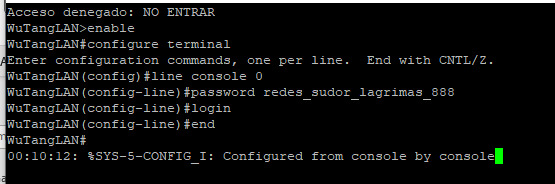
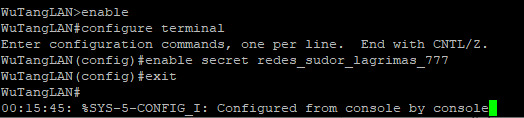
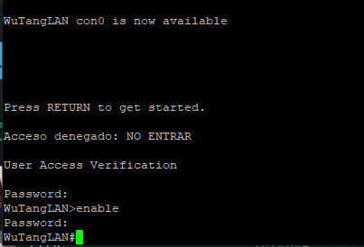
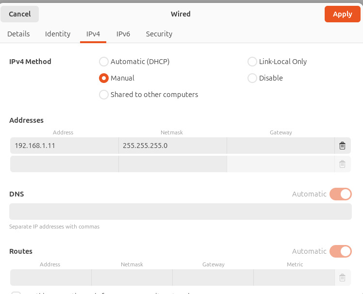
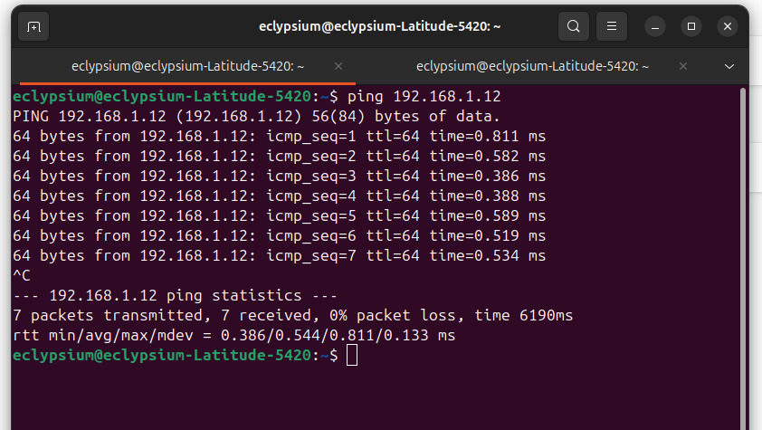
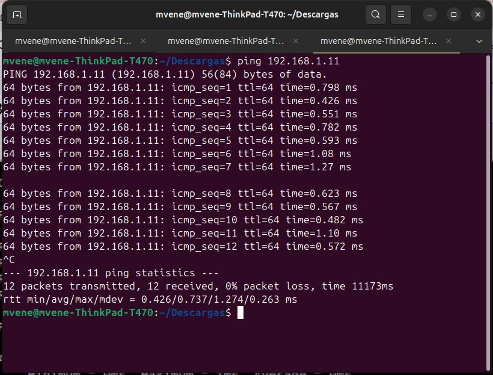
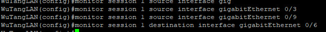

 

# Trabajo Práctico N°1 Redes de Computadoras,FCEFyN-UNC #
## Fecha de entrega: 27/03/2025 ##

ctrl+shift+v to visualize preview 

## Profesores: ##
  -Santiago Martin Henn
  -Francisco Nicolas Oliva Cuneo

## Nombre del Grupo: ##
 “Redes,Sudor y Lágrimas” 

## Integrantes: ##
- Badariotti, Juan Miguel - 42260003
- Cáceres, Juan Manuel - 
- Erlicher, Ezequiel - 42051917
- Dallari,

 

# Parte I - Configuración y Análisis de tráfico IPv4/IPv6 #

## 2) Creación de una Red ##

Se configura la siguiente topología en Packet Tracer para realizar los apartados 4) ,5), 6) y 7)

## 3) ##

## 4)  Conectividad IPv4 entre todos los host ##

Se evalúa la conectividad entre las 3 computadoras de la topología mostrada en  el punto 2
mediante el envío de paquetes ICMPv4 usando el comando `ping`

PC0:

PC1:

PC2:

## 5)  Conectividad IPv6 entre todos los host ##

ahora se evalúa de nuevo la conectividad de las 3 computadoras de la topología 2) pero ahora con respecto a sus direcciones IPv6 enviando paquetes ICMPv6(también con el comando `ping`)

IPv6 PC0:

IPv6 PC1:

IPv6 PC2:

 

# Parte II - Configuración y Análisis de tráfico IPv4/IPv6 #

## a y b) Conexión al switch y modificación de contraseñas 

En primera instancia se configura la contraseña para acceder al modo usuario tal como se muestra en la siguiente imagen

Posteriormente, se configuran las contraseñas para acceder el modo priviledged

una vez configuradas se ve como al reingresar al switch se solicitan ambas
contraseñas

## c) Conexión de 2 computadoras y testeo de conectividad

Se conectan 2 computadoras al switch con Ubuntu OS mediante cables Ethernet (RJ45).Se configuraron las siguientes direcciones IP `192.168.1.12` y `192.168.1.11` respectivamente desde el admininistrador de red ethernet de cada laptop.

La configuración para la computadora con IP `192.168.1.12` se hace de manera análoga

Una vez configuradas las IP's, se testeo la conectividad entre ambas mediante comandos PING.

## d) Configuración de un puerto en modo mirroring y monitoreo de tráfico

Se establecen los puerto 3 y 9 como puertos source donde se conectan posteriormente las computadoras. El puerto a donde se conecta la computadora que va a interceptar el tráfico 
es el 6
