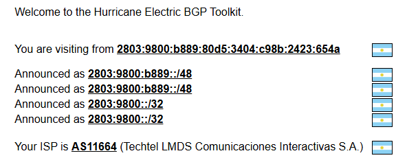
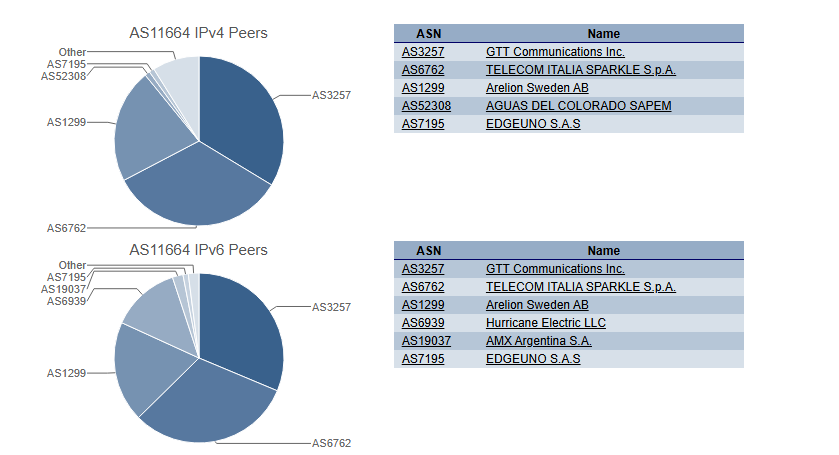
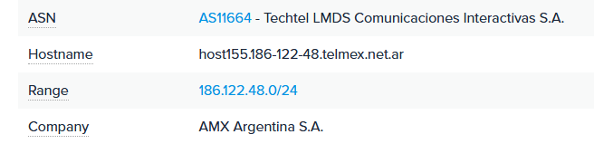
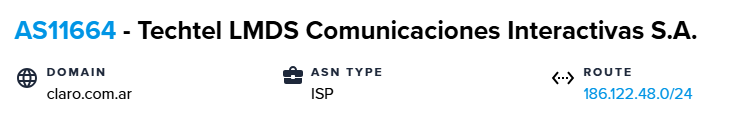
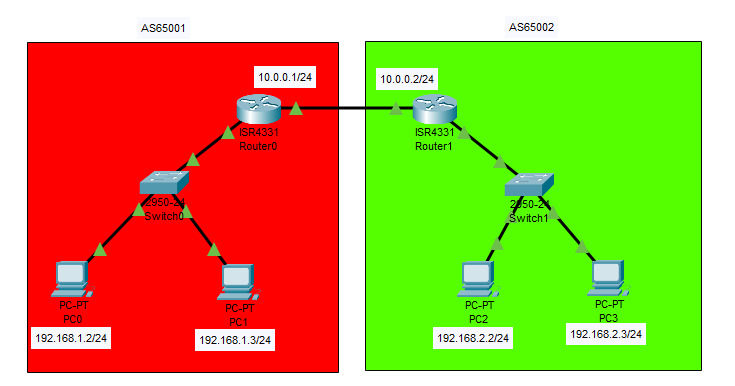

 

# Trabajo Práctico N°4 Redes de Computadoras,FCEFyN-UNC #
## Fecha de entrega: -/05/2025 ##

## Profesores: ##
- Santiago Martin Henn
- Francisco Nicolas Oliva Cuneo

## Nombre del Grupo: ##
 **“Redes,Sudor y Lágrimas”** 

## Integrantes: ##
- Badariotti, Juan Miguel - 42260003
- Cáceres, Juan Manuel - 41411969
- Erlicher, Ezequiel - 42051917
- Dallari, Giuliano - 42642389

## PARTE I: Integración de conceptos, actividades online e investigación ##

**Autonomous System**

Un sistema autónomo (AS) es una red grande o grupo de redes que tiene una política de enrutamiento unificada. Cada ordenador o dispositivo que se conecta a Internet está conectado a un AS. Cada AS controla un conjunto específico de direcciones IP. El rango de direcciones IP que controla un determinado EA se denomina su "espacio de direcciones IP". La mayoría de los AS se conectan a otros AS. Si un AS se conecta solo a otro AS y comparte la misma política de enrutamiento, puede considerarse una subred del primer AS. Lo normal es que cada AS la gestione una única gran organización, como un proveedor de acceso a Internet (ISP), una gran empresa tecnológica, una universidad o una agencia gubernamental.

Una política de enrutamiento de AS es una lista del espacio de direcciones IP que controla el AS, además de una lista de los otros AS con los que se conecta. Esta información es necesaria para enrutar los paquetes a las redes correctas. Los AS anuncian esta información a Internet mediante el Border Gateway Protocol (BGP).

Los AS se identifican mediante números únicos llamados números de Sistema Autónomo (ASN), que ayudan a dirigir el tráfico de Internet de manera eficiente entre ellos.

**Autonomous System Number (ASN)**

Un número de Sistema Autónomo (ASN) es un identificador único que se asigna a un Autonomous System (AS) para facilitar su identificación en Internet. Funciona de manera similar a un número de teléfono único para un dispositivo en una red de telefonía: ayuda a dirigir el tráfico de Internet de manera eficiente hacia y desde ese AS específico.
El ASN está formado por un número entero de 16 bits, lo que significa que hay un rango potencial de 65,536 números ASN únicos disponibles para asignar. Estos números se asignan y administran a nivel mundial por los Registros de Internet Regionales (RIR), como ARIN para América del Norte, RIPE NCC para Europa, APNIC para Asia-Pacífico, entre otros.
Para asignar un ASN, generalmente se deben seguir ciertas reglas y criterios establecidos por los RIR. Estos criterios pueden incluir demostrar la necesidad real del ASN para el crecimiento de la red, la capacidad técnica para administrarlo adecuadamente y el cumplimiento de las políticas de enrutamiento y asignación de direcciones IP.

Entregar ASN a la ligera puede tener varias consecuencias negativas. Por un lado, puede agotar el suministro limitado de números ASN disponibles, lo que dificulta que otras organizaciones legítimas obtengan los números que necesitan para expandir sus redes. Además, podría generar problemas de enrutamiento si las organizaciones que reciben los ASN no tienen la capacidad técnica adecuada para administrarlos correctamente, lo que podría causar congestión de la red, ineficiencia en el enrutamiento o incluso interrupciones en la conectividad de Internet. En resumen, la asignación imprudente de ASN podría afectar negativamente la estabilidad y eficiencia de Internet en su conjunto.

Actualmente, los números de Sistema Autónomo (ASN) se encuentran en alta demanda debido al continuo crecimiento de Internet y la proliferación de dispositivos conectados. La mayoría de los ASN asignados ya están en uso por diversas organizaciones en todo el mundo para gestionar sus redes. Sin embargo, en ocasiones, algunos ASN asignados pueden quedar en desuso debido a la reorganización de redes, cambios en la infraestructura o la finalización de proyectos. En tales casos, si se detecta que un ASN asignado está en desuso, los registros de Internet correspondientes pueden realizar un proceso de reasignación o reutilización del número para asegurar su eficiente utilización y evitar el agotamiento prematuro de los recursos.

**Algunos ejemplos de ASN pueden ser :** 

AS27790: Asignado a la Universidad Nacional de Córdoba

AS10481: Asignado a Telecom Argentina S.A. (Aparecen multiples ASN para esta empresa)

AS27730: Asignado a BBVA Banco Frances SA

**¿Cómo podemos saber a que AS está asociada nuestra red?**

Existen diversas páginas para saberlo, una de ellas es https://bgp.he.net/ que al ingresar nos indicará el ASN asignado de nuestra red. Un ejemplo es 

Soporta los protocolos PV4 Y PV6

Tambien podemos visualizar la información de los peers (pares de conexión BGP) de nuestro ASN, el cual corresponde a un proveedor u organización con presencia en Internet. 

Tambien hay paginas como  que nos permiten visualizar la siguiente informacion:

## PARTE II: Simulaciones y análisis ##

Se construyo la siguiente topología conformada por dos AS en Packet Tracer: 65001 Y 65002

Se establecen las rutas BGP en ambos routers con los siguientes comandos:

`router bgp [AS_NAME]`

`bgp log-neighbor-changes`

`neighbor [AS_next_hop] remote-as [neighborAS_name]`

`network [network_address] mask [mask]`

con la ayuda del comando `show ip bgp summary`, se verifica que se hallan establecido correctamente:

Testeo de conectividad de PC1 a las PCs del AS 65002

Testeo de conectividad de PC2 a las PCs del AS 65001

