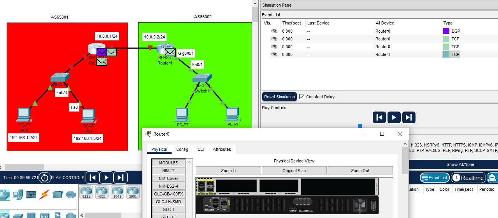

 

# Trabajo Práctico N°4 Redes de Computadoras,FCEFyN-UNC #
## Fecha de entrega: -/05/2025 ##

## Profesores: ##
- Santiago Martin Henn
- Francisco Nicolas Oliva Cuneo

## Nombre del Grupo: ##
**“Redes,Sudor y Lágrimas”**

## Integrantes: ##
- Badariotti, Juan Miguel - 42260003
- Cáceres, Juan Manuel - 41411969
- Erlicher, Ezequiel - 42051917
- Dallari, Giuliano - 42642389

## PARTE I: Integración de conceptos, actividades online e investigación ##

**Autonomous System**

Un sistema autónomo (AS) es una red grande o grupo de redes que tiene una política de enrutamiento unificada. Cada ordenador o dispositivo que se conecta a Internet está conectado a un AS. Cada AS controla un conjunto específico de direcciones IP. El rango de direcciones IP que controla un determinado EA se denomina su "espacio de direcciones IP". La mayoría de los AS se conectan a otros AS. Si un AS se conecta solo a otro AS y comparte la misma política de enrutamiento, puede considerarse una subred del primer AS. Lo normal es que cada AS la gestione una única gran organización, como un proveedor de acceso a Internet (ISP), una gran empresa tecnológica, una universidad o una agencia gubernamental.

Una política de enrutamiento de AS es una lista del espacio de direcciones IP que controla el AS, además de una lista de los otros AS con los que se conecta. Esta información es necesaria para enrutar los paquetes a las redes correctas. Los AS anuncian esta información a Internet mediante el Border Gateway Protocol (BGP).

Los AS se identifican mediante números únicos llamados números de Sistema Autónomo (ASN), que ayudan a dirigir el tráfico de Internet de manera eficiente entre ellos.

**Autonomous System Number (ASN)**

Un número de Sistema Autónomo (ASN) es un identificador único que se asigna a un Autonomous System (AS) para facilitar su identificación en Internet. Funciona de manera similar a un número de teléfono único para un dispositivo en una red de telefonía: ayuda a dirigir el tráfico de Internet de manera eficiente hacia y desde ese AS específico.
El ASN está formado por un número entero de 16 bits, lo que significa que hay un rango potencial de 65,536 números ASN únicos disponibles para asignar. Estos números se asignan y administran a nivel mundial por los Registros de Internet Regionales (RIR), como ARIN para América del Norte, RIPE NCC para Europa, APNIC para Asia-Pacífico, entre otros.
Para asignar un ASN, generalmente se deben seguir ciertas reglas y criterios establecidos por los RIR. Estos criterios pueden incluir demostrar la necesidad real del ASN para el crecimiento de la red, la capacidad técnica para administrarlo adecuadamente y el cumplimiento de las políticas de enrutamiento y asignación de direcciones IP.

Entregar ASN a la ligera puede tener varias consecuencias negativas. Por un lado, puede agotar el suministro limitado de números ASN disponibles, lo que dificulta que otras organizaciones legítimas obtengan los números que necesitan para expandir sus redes. Además, podría generar problemas de enrutamiento si las organizaciones que reciben los ASN no tienen la capacidad técnica adecuada para administrarlos correctamente, lo que podría causar congestión de la red, ineficiencia en el enrutamiento o incluso interrupciones en la conectividad de Internet. En resumen, la asignación imprudente de ASN podría afectar negativamente la estabilidad y eficiencia de Internet en su conjunto.

Actualmente, los números de Sistema Autónomo (ASN) se encuentran en alta demanda debido al continuo crecimiento de Internet y la proliferación de dispositivos conectados. La mayoría de los ASN asignados ya están en uso por diversas organizaciones en todo el mundo para gestionar sus redes. Sin embargo, en ocasiones, algunos ASN asignados pueden quedar en desuso debido a la reorganización de redes, cambios en la infraestructura o la finalización de proyectos. En tales casos, si se detecta que un ASN asignado está en desuso, los registros de Internet correspondientes pueden realizar un proceso de reasignación o reutilización del número para asegurar su eficiente utilización y evitar el agotamiento prematuro de los recursos.

**Algunos ejemplos de ASN pueden ser :** 

AS27790: Asignado a la Universidad Nacional de Córdoba

AS10481: Asignado a Telecom Argentina S.A. (Aparecen multiples ASN para esta empresa)

AS27730: Asignado a BBVA Banco Frances S.A.

**¿Cómo podemos saber a que AS está asociada nuestra red?**

Existen diversas páginas para saberlo, una de ellas es https://bgp.he.net/ que al ingresar nos indicará el ASN asignado de nuestra red. Un ejemplo es 

Soporta los protocolos PV4 Y PV6

Tambien podemos visualizar la información de los peers (pares de conexión BGP) de nuestro ASN, el cual corresponde a un proveedor u organización con presencia en Internet.

Tambien hay paginas como ipinfo.io que nos permiten visualizar la siguiente informacion:

**¿Qué es el Border Gateway Protocol (BGP)?**

El Border Gateway Protocol (BGP) es un protocolo de ruteo exterior (EGP) diseñado para intercambiar información de ruteo entre diferentes Sistemas Autónomos (AS) en internet. Es el protocolo que permite que redes independientes (por ejemplo, las de proveedores de internet, universidades, empresas) se comuniquen entre sí y compartan las mejores rutas para alcanzar distintas redes IP.
BGP está definido en la RFC 4271 y se lo considera un protocolo de vector de camino, ya que en lugar de usar simplemente el costo o la distancia, elige rutas basándose en políticas definidas por el administrador de red y la lista de AS que una ruta atraviesa (AS Path).
Es un protocolo confiable y robusto, pero también complejo y lento para converger, ya que está optimizado para estabilidad más que velocidad.

**Resúmen del funcionamiento del BPG.**

- Adquisición de vecino (peer):
Los routers BGP establecen una sesión TCP (puerto 179) entre ellos para intercambiar información. Estos routers se llaman "pares" o peers. La relación puede ser interna (iBGP) o externa (eBGP).

- Detección de vecino alcanzable:
Una vez establecida la conexión TCP, los routers envían mensajes de tipo KEEPALIVE periódicamente para asegurarse de que el vecino sigue activo.

- Detección de red alcanzable:
BGP intercambia información sobre qué redes IP pueden alcanzarse a través de cada peer, usando mensajes de tipo UPDATE. Esta información incluye el camino de AS (AS-PATH), atributos como NEXT_HOP, y otros.

Existen diferentes tipos de mensajes BGP como ser:

- OPEN: Inicia la sesión BGP entre routers. Contiene información como ASN del router, versión BGP, etc.

- UPDATE: Informa rutas nuevas alcanzables o elimina rutas obsoletas. Es el mensaje más complejo.

- KEEPALIVE: Se envía regularmente para mantener viva la conexión entre pares BGP.

- NOTIFICATION: Se envía cuando ocurre un error, y cierra la conexión.

Todos los mensajes BGP comparten una cabecera de 19 bytes que incluye:

- Marker (16 bytes): para autenticación y detección de errores.

- Length (2 bytes): indica la longitud total del mensaje.

- Type (1 byte): indica el tipo de mensaje (OPEN, UPDATE, etc.).

Luego, cada tipo de mensaje tiene su propia estructura de datos.

**¿Cual es la diferencia entre eBGP e iBGP?**

- eBGP (External BGP):
Se utiliza para intercambiar rutas entre routers que pertenecen a diferentes AS. Los routers eBGP normalmente están directamente conectados. Este tipo de BGP se usa para anunciar rutas públicas hacia otros AS.

- iBGP (Internal BGP):
Se utiliza dentro de un mismo AS para distribuir las rutas aprendidas por eBGP a todos los routers del AS. A diferencia del eBGP, los routers iBGP no necesitan estar directamente conectados, pero deben formar una malla completa (o usar route reflectors).

**¿Qué es un AS de tránsito?**

Un AS de tránsito es aquel que recibe tráfico de un AS y lo reenvía hacia otro AS, actuando como intermediario. Su objetivo es facilitar el paso de tráfico hacia otros destinos, no solo entregar tráfico hacia sus propias redes.

En el ejemplo del trabajo el AS2 actúa como AS de tránsito, porque recibe tráfico desde AS1 a través de R2, lo enruta internamente usando iBGP (entre R2 y R3) y luego lo reenvía a AS3 a través de R3.

**Ejemplo de conexiones AS de la conexión actual (PC con conexion Fibertel/Personal/Telecom):**

- IP pública actual: 190.195.15.219

- ASN actual: AS7303

- Nombre del proveedor: Telecom Argentina S.A.

- Ubicación: Argentina

- Protocolos soportados: IPv4, IPv6

- Tipo de AS: Tier 2 (proveedor de tránsito y acceso residencial)

- Conexiones eBGP: Según el gráfico obtenido en bgpview.io/asn/7303, el AS7303 tiene conexiones eBGP con al menos 5 AS directamente visibles (AS22927, AS12956, AS3257, AS6762, AS33356). También aparecen conexiones indirectas o de segundo grado con otros (AS174, AS7018, AS6453, AS6939, AS6830, AS2497)
Esto indica que AS7303 participa activamente del enrutamiento global, lo cual es consistente con su rol como ISP nacional.

- Gráfico: El siguiente diagrama muestra las conexiones de AS7303 a uno y dos grados de separación:

**Ejemplo de conexiones AS de la conexión secundaria (Smartphone con conexión 4G ClaroAR):**

- IP pública actual: 190.195.15.219

- ASN actual: AS7303

- Nombre del proveedor: Telecom Argentina S.A.

- Ubicación: Argentina

- Protocolos soportados: IPv4, IPv6

- Tipo de AS: Tier 2 (proveedor de tránsito y acceso residencial)

Se puede observar que si bien tienen diferentes conexiónes se encuentran en la misma AS.

**Ejemplo de incidente famoso:**

BGP leak de Vodafone India (junio 2019)

- Causa: Vodafone India (ASN 55410) publicó por error una gran cantidad de prefijos IP a través de BGP, lo que causó un "BGP leak". Estos prefijos se redistribuyeron a nivel global a través de AS174 (Cogent), un proveedor de tránsito importante.

- Consecuencia: Grandes interrupciones en servicios como Cloudflare, Amazon AWS y Facebook. Pérdida de conectividad global parcial durante más de 1 hora. Muchos usuarios no pudieron acceder a sitios web ni a servicios de nube.

- Razón técnica: El router de Vodafone filtró rutas que no debía anunciar y otros AS confiaron en esa información, redirigiendo tráfico por caminos incorrectos.

- Impacto: Este evento mostró que BGP no tiene validación de rutas por defecto, lo que lo hace vulnerable a errores o ataques (como hijacking).

## PARTE II: Simulaciones y análisis ##

Se construyo la siguiente topología conformada por dos AS en Packet Tracer: 65001 Y 65002

La tabla de red queda definida de esta manera:

Se establecen las rutas BGP en ambos routers con los siguientes comandos:

`router bgp [AS_NAME]`

`bgp log-neighbor-changes`

`neighbor [AS_next_hop] remote-as [neighborAS_name]`

`network [network_address] mask [mask]`

ACLARACIÓN: Packet tracer no permite configurar rutas IPv6 para BGP, por lo tanto en este apartado solo se trabaja con IPv4. Mas adelante,patrabajar con redes IPv6, se usaron redes estáticas o OSPF

con la ayuda del comando `show ip bgp summary`, se verifica que se hallan establecido correctamente:

Una vez configurado el protocolo BGP en los routers, se procede a configurar las direcciones IPv4 e IPv6 según se definía anteriormente en la tabla, para luego  testear la conectividad entre todas las PCs:

**Testeo de conectividad de PC0 a las PCs del AS 65002**

**Testeo de conectividad de PC1 a las PCs del AS 65002**

**Testeo de conectividad de PC2 a las PCs del AS 65001**

**Testeo de conectividad de PC3 a las PCs del AS 65001**

### Simular tráfico en la red. Apagar y encender alguno de los routers, y analizar el tráfico visualizado ###

Se observa un único paquete BGP cuando se apaga el router 0, seguidos de varios paquetes TCP
que se emiten como consecuencia del enlace interrumpido:

Luego, al apagar y encender el router:

Se observa el intercambio de paquetes BGP OPEN, luego KEEPALIVEs, posteriormente  UPDATES y luego solo se siguen comunicando con KEEPALIVEs  indefinidamente.

### Agregado de un nuevo host a AS65001 ###

Se agregó un Router2 a AS65001 junto con PC4 conectada mediante un switch a dicho Host de la siguiente manera:

Por lo tanto, a la tabla de la red original se le añaden estas nuevas entradas:

Se configuraron rutas estáticas IPv4 e IPv6, usando los comandos de configuración global `ip route` y `ipv6 route` tanto en el router 2 como en el router 0 y 1, para que de esta manera, PC4 pudiera comunicarse con el resto de las PCs, a continuación se comprueba la conectividad:

**Testeo de la conectividad de PC4 al resto de los host en AS65001**:

**Testeo de la conectividad de PC4 a los host en AS65002**:

### Redistribución de OSPF en BGP ###

Se procede, en primera instancia, a eliminar todas las rutas estáticas establecidas anteriormente (ya que dichas rutas serán aprendidas gracias al trabajo conjunto de los protocolos OSPF y BGP). Una vez hecho esto, se configura OSPF en los routers 
0 y 2 tanto para IPv4 como IPv6 (es importante,para poder realizar los pasos de configuración en IPv6, ejecutar previamente el comando `ipv6 unicast-routing`)

Ahora, se configura nuevamente la ruta BGP en el router 1 para que sea consciente del AS65001

A continuación se le indica al Router 0 para que distribuya las rutas aprendidas por OSPF a BGP:

Mediante el comando `show ip route` verificamos por un lado que el router 0 es consciente de la ruta BGP a AS65002, debido a la ruta BGP configurada previamente :

Luego, podemos ver que gracias a la distribución de OSPF a BGP establecida en el router 0, el router 1 "aprendió" la ruta que lleva a la red 192.168.3.0 ( Red a la cual está conectada PC4) 

Finalmente podemos ver que, nuevamente, PC4 puede acceder no solo a las PCs dentro de su AS sino tambíen a las del AS65002:

