# Trabajo Práctico N°5 Redes de Computadoras,FCEFyN-UNC #
## Fecha de entrega: -/06/2025 ##

## Profesores: ##
- Santiago Martin Henn
- Francisco Nicolas Oliva Cuneo

## Nombre del Grupo: ##
**“Redes,Sudor y Lágrimas”**

## Integrantes: ##
- Badariotti, Juan Miguel - 42260003
- Cáceres, Juan Manuel - 41411969
- Erlicher, Ezequiel - 42051917
- Dallari, Giuliano - 42642389

## 1) ##

Se desarollaron dos scripts en python, los cuales permiten enviar paquetes desde un "server" TCP a un "cliente" TCP (ver `serverTCP.py`,`clientTCP.py`). Cada paquete enviado contiene el nombre del grupo, el número de paquete y el timestamp de cuando fue enviado (indicado como ST: send time). El cliente, al recibir el paquete agrega su timestamp (RT:reception time) La variable global `HOST` en el script del cliente, se corresponde con la dirección IP del servidor (la PC que envía los paquetes). 

A continuación se muestra el proceso de envío y recepción entre dos computadoras, ambas con sistema operativo Windows

**Sevidor:**

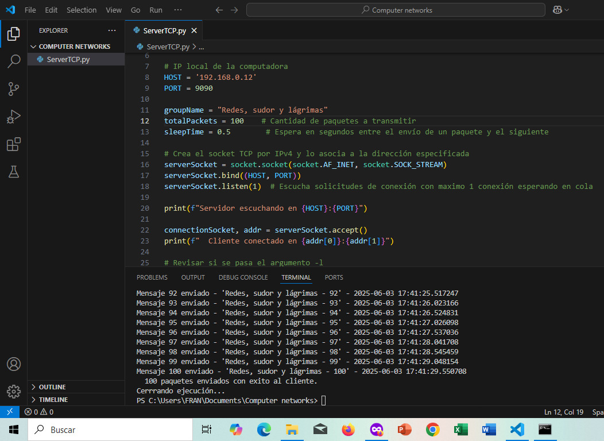

**Cliente:**

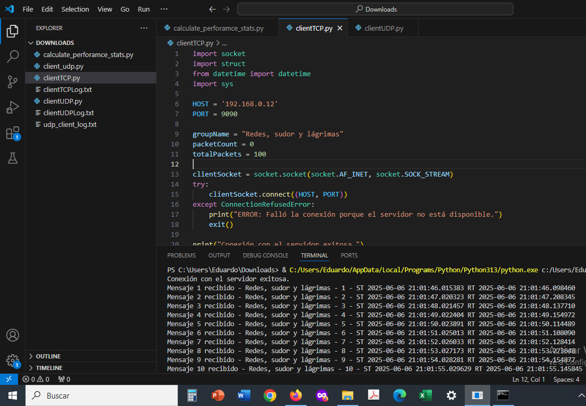

Los mismos scripts, al correrse el script del cliente, pasandole el parámetro `-l`, se crea un log con los mensajes recibidos, el timestamp de cuando fueron enviados y el timestamp d ecuando fueron recibidos (Ver la carpeta `logs`)

Mediante Wireshark, se selecciona un paquete recibido al azar en el cliente y se analiza su contenido.
Se puede ver la carga útil,es decir,el mensaje recibido señalado en rojo

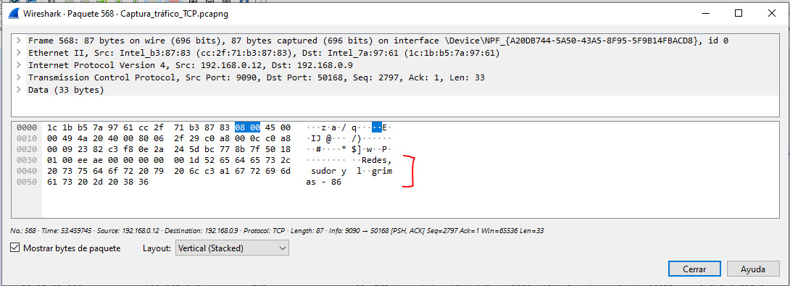

## 2) ##

De manera análoga,se crearon dos scripts los cuales permiten enviar paquetes entre un "server" UDP a un "cliente" UDP

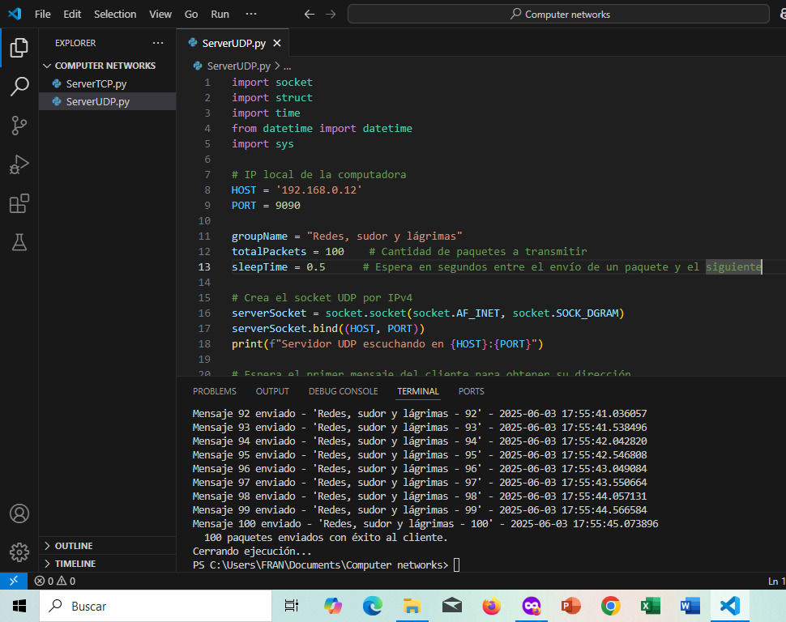

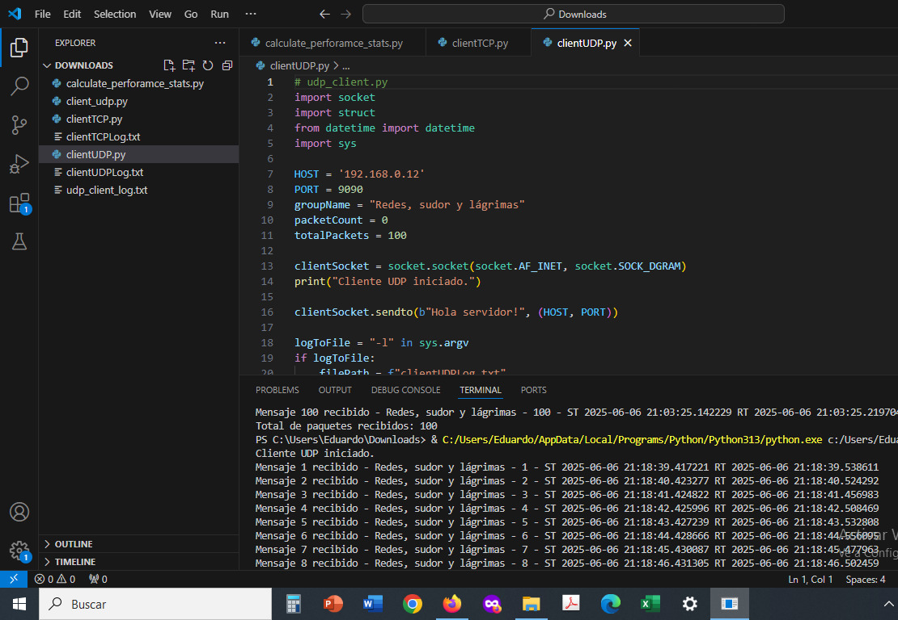

Al igual que se mostraba con el cliente y servidor TCP, mediante el parámetro `-l`, se crean logs con los mensajes enviados por el server y recibidos por el cliente

Nuevamente, haciendo uso de Wireshark, se selecciona un paquete recibido y se observa la carga útil

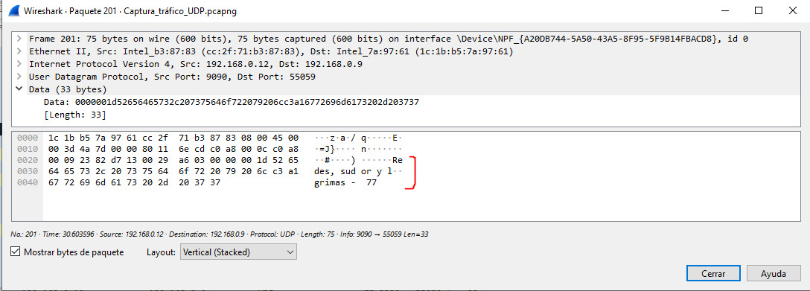

## 3) ##

Se desarolló el script `calculate_performance_stats.py`para calcular los siguientes parámetros de las
conexiónes TCP y UDP

- Latencia promedio
- Latencia máxima
- Latencia mínima
- Jitter promedio 

El mismo arrojó el siguiente resultado para 100 paquetes transmitidos en intervalos de 1 segundo:

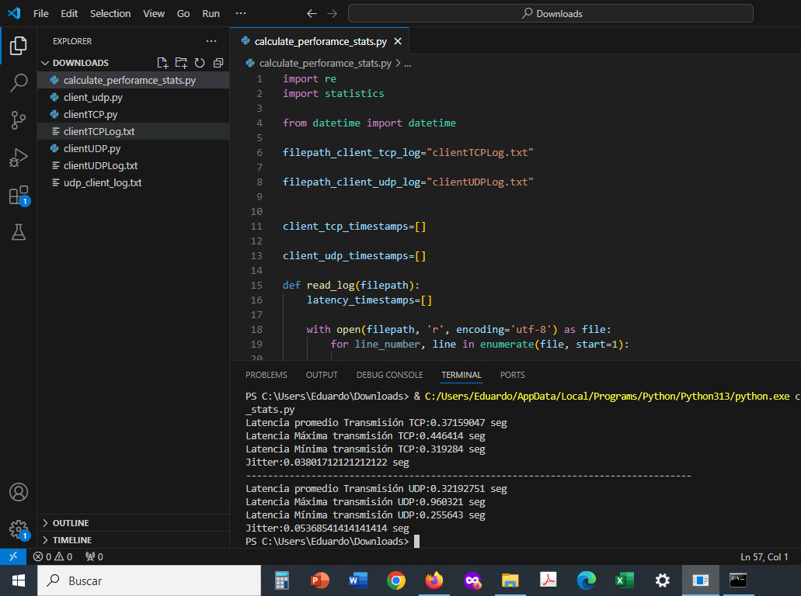

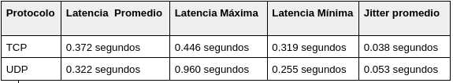

Se puede ver como la performance UDP es más rápida debido a la ausencia de los mecanismos de control de TCP para asegurar,entre otras cosas, la entrega de los paquetes,dando como resultado, paquetes mas pequeños y sencillos, tal como se observaba en las capturas con wireshark. Esto último, sin embargo, implica que el jitter de UDP es mayor, es decir, la variabilidad entre los tiempos de recepción de los paquetes es mucho mas amplia, sumado a que pueden perderse paquetes (cosa que ocurre en algunas ejecuciones de los scripts UDP). 

## 4) ##

### Cifrado simétrico vs cifrado asimétrico ###

**Cifrado Simétrico**

El cifrado simétrico se basa en una única clave secreta que se utiliza tanto para cifrar como para descifrar datos. Esto significa que tanto el emisor como el receptor deben poseer la misma clave y mantenerla confidencial. Se caracteriza por su rapidez y eficiencia, lo que lo hace ideal para encriptar grandes volúmenes de datos. Se lo suele usar en general en los siguientes escenarios: 

- Cifrado de archivos, 
- Cifrado de discos  
- Protocolos de comunicación seguros donde la velocidad es crucial. 

Algunos algoritmos de cifrado simétrico ampliamente utilizados incluyen AES (Estándar de Cifrado Avanzado), DES (Estándar de Cifrado de Datos) y Blowfish.

El cifrado simétrico presenta el problema de la distribución de claves. Dado que ambas partes deben conocer la misma clave, esta debe compartirse a través de un canal seguro antes de iniciar la comunicación. Si un atacante intercepta esta clave, podrá descifrar cualquier mensaje cifrado con ella.

**Cifrado asimétrico**

El cifrado asimétrico, también conocido como criptografía de clave pública, utiliza dos claves: una pública y una privada. La clave pública se comparte abiertamente y cualquiera puede usarla para cifrar datos, mientras que la clave privada, mantenida en secreto por su propietario, se utiliza para descifrar los datos.

Una de las principales ventajas del cifrado asimétrico es que elimina la necesidad de compartir una clave secreta previamente, lo que lo hace especialmente útil para la comunicación segura en internet. También permite funciones como las firmas digitales, donde un usuario puede firmar un mensaje con su clave privada y otros pueden verificar la autenticidad utilizando la clave pública.

Sin embargo, el cifrado asimétrico suele ser más lento y requiere más recursos computacionales que el cifrado simétrico. Por lo tanto, no es ideal para cifrar grandes cantidades de datos. Entre los algoritmos de cifrado asimétrico más populares se incluyen RSA, Criptografía de Curva Elíptica (Elliptic Curve Cryptography) y DSA (Digital Signature Algorithm).

A los scripts, anteriores, se les agregó un mecanismo de encriptación simétrica mediante el módulo `fernet` dentro de cryptography (la cual se instala previamente con el comando `pip install cryptography`).Proporciona cifrado simétrico mediante AES-CBC con padding PKCS7, además de autenticación basada en HMAC. Está diseñado para ofrecer un cifrado de alto nivel, fácil de usar y seguro,sin necesidad de que los usuarios gestionen detalles criptográficos de bajo nivel. Sin embargo, no se recomienda usa si se necesita mas flexibilidad en cuanto a los algoritmos de encriptado que se desean usar o si se necesita encriptar cantidades importantes de información. 

Ejecución de los scripts con cifrado simétrico mediante `fernet`:

**Servidor TCP**

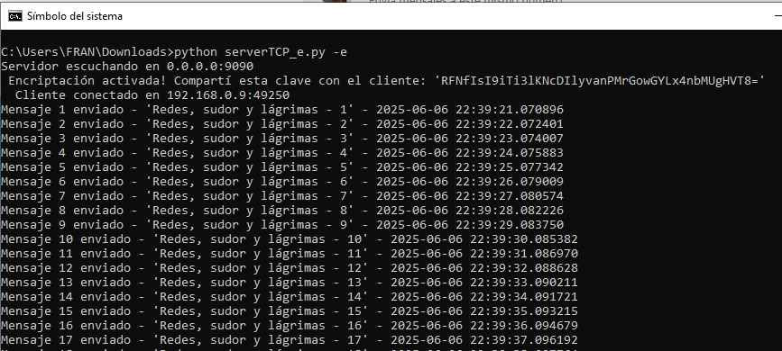

**Cliente TCP**

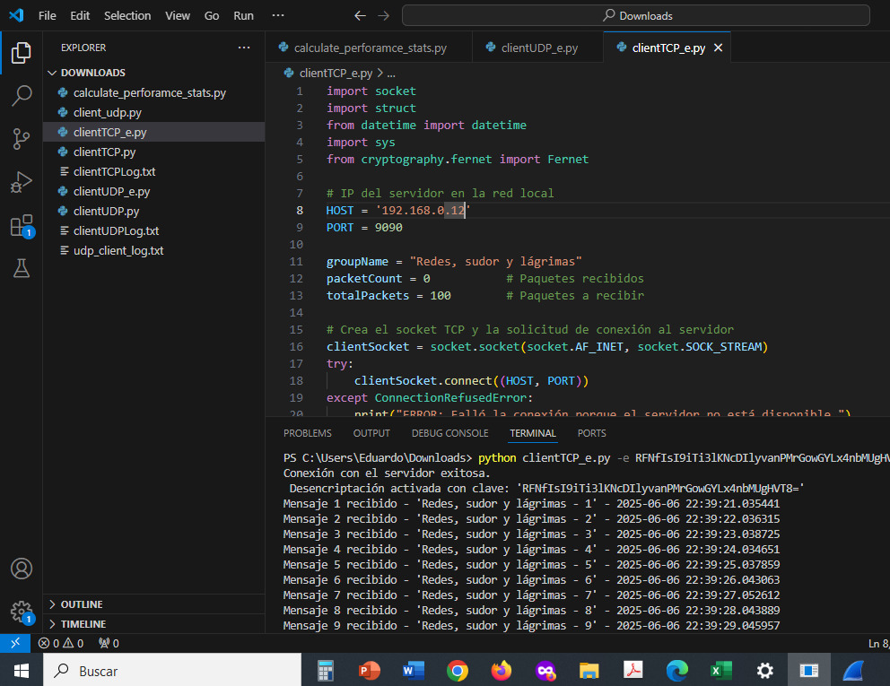

**Servidor UDP**

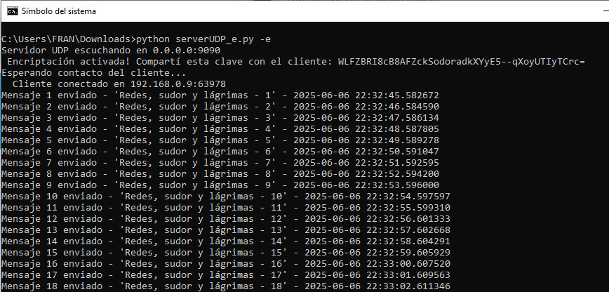

**Cliente UDP**

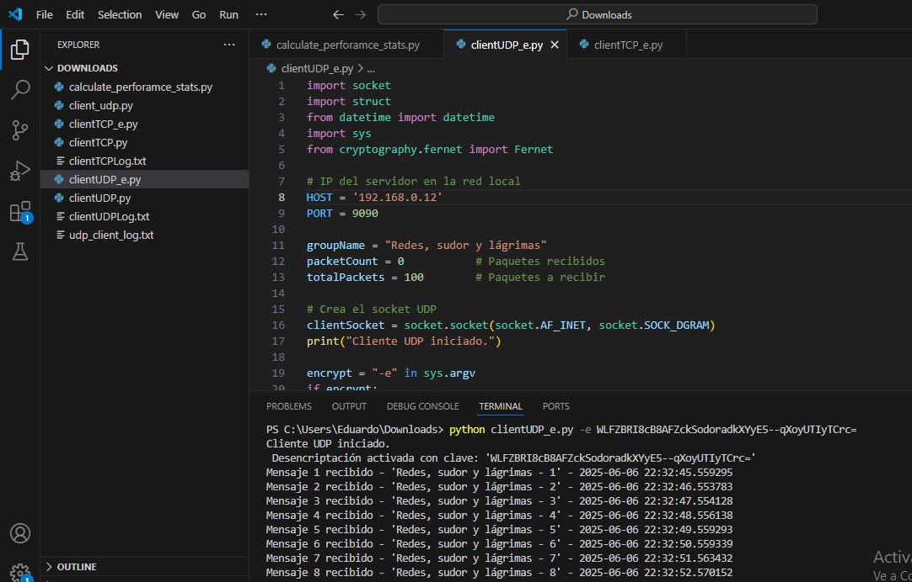

Haciendo cappturas de tráfico nuevamente con Wireshark, vemos que la carga se encuentra encryptada en ambos protocolos, impiediendo que podamos leer el mensaje que se recibió:

**TCP**

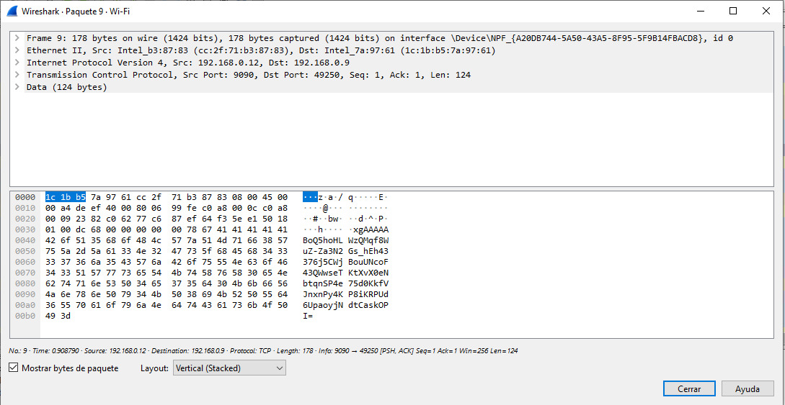

**UDP**

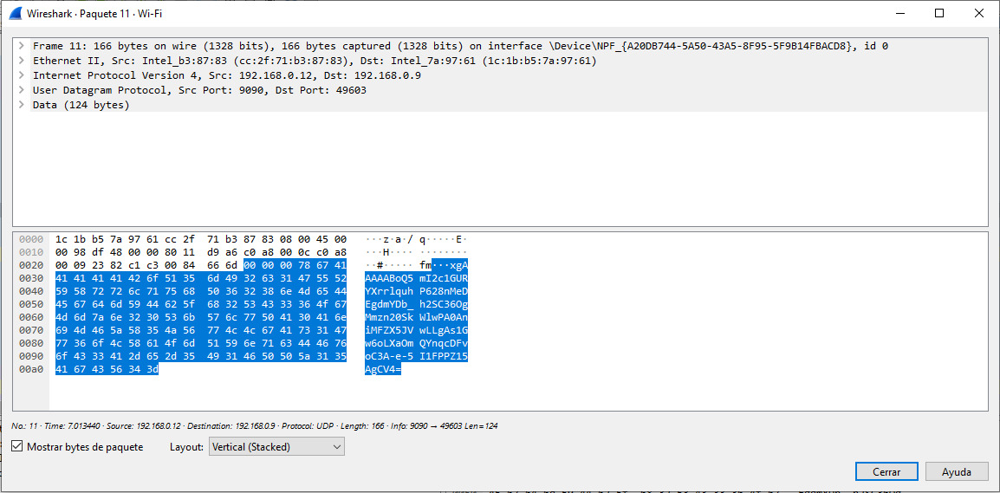

Si los clientes y servidores se encontraran separados por varios kilómetros, y se quisiera encriptar la comunicación, siendo que nunca intercambiaron información antes, y suponiendo que quiere transmitir mas que solo unos cientos de bytes, lo mejor es adoptar un esquema híbrido

Primero,se podría usar un algoritmo de encriptación asimétrico como RSA para transferir una clave pública entre ambas entidades, por ejemplo del cliente al servidor. Una vez hecho esto, el servidor utiliza un algoritmo simétrico para generar una clave única y luego, cifrarla utilizando la clave pública que le fue compartida. Una vez hecho esto, la clave encriptada se transfiere al cliente permitiendo que ahora ambas entidades puedan intercambiar información encriptada usando una única clave.Para implementar dicho procedimiento en los scripts, se puede usar los módulos `hazmat` y `fernet` dentro de la librería `cryptography`
